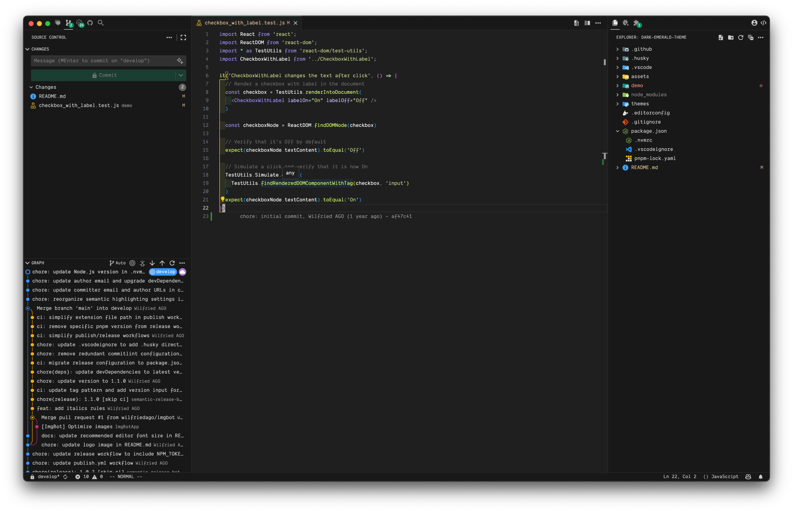

<div align="center">
  <h1 align="center">Dark Emerald Theme</h1>
  <p align="center">Another minimalist dark theme for Visual Studio Code, inspired by <a href="https://marketplace.visualstudio.com/items?itemName=CodeSandbox-io.codesandbox-projects-theme">Code Sandbox Theme</a>.</p>
</div>



## Install

Install this theme [from the Marketplace](https://marketplace.visualstudio.com/items?itemName=wilfriedago.dark-emerald-theme).

## Recommendations

Below you can find a few recommendations for your `settings.json` to match the preview:

```json
{
  "editor.fontSize": 13,
  "editor.fontFamily": "'JetBrains Mono'",
  "editor.fontLigatures": true
}
```

- You can download the JetBrains Mono font [here](https://www.jetbrains.com/lp/mono/).
- The icon theme used in the preview is [Glyph for vscode](https://marketplace.visualstudio.com/items?itemName=lewxdev.vscode-glyph).
- The product icon theme used in the preview is [Material Product Icons](https://marketplace.visualstudio.com/items?itemName=PKief.material-product-icons).
- For further customization, you can use the [Apc Customize UI++](https://marketplace.visualstudio.com/items?itemName=drcika.apc-extension).

## Contribute

Found an issue? Would like to propose an improvement? Please follow our [Contribution guidelines](CONTRIBUTING.md) to make those changes happen. Thank you!
